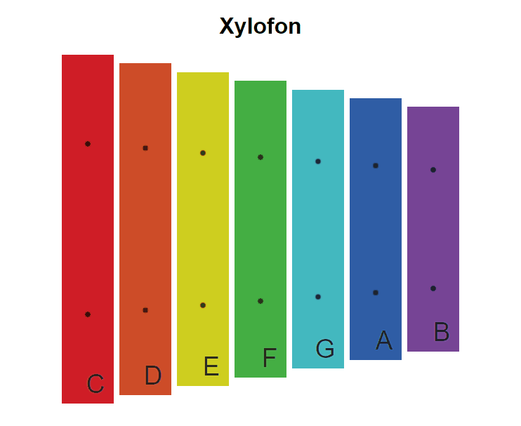

# Cvičení: Xylofon

## Zadání

Oživ xylofon, aby kliknutí na jednotlivé kameny měnilo nadpis stránky podle písmene na kameni a ozval se příslušný tón.

1. Stáhni si zadání jako [ZIP](https://github.com/Czechitas-podklady-WEB/Cviceni-Xylofon-v-Reactu/archive/main.zip) nebo forkni [tento repozitář](https://github.com/Czechitas-podklady-WEB/Cviceni-Xylofon-v-Reactu) a kopii k sobě naklonuj.
1. Otevři příkazovou řádku ve složce s podklady.
1. Nainstaluj závislosti pomocí `npm install`.
1. Spusť vývojový server přes `npm start`.
1. Uprav soubor `src/Xylofon.jsx` podle komentářů uvnitř.
